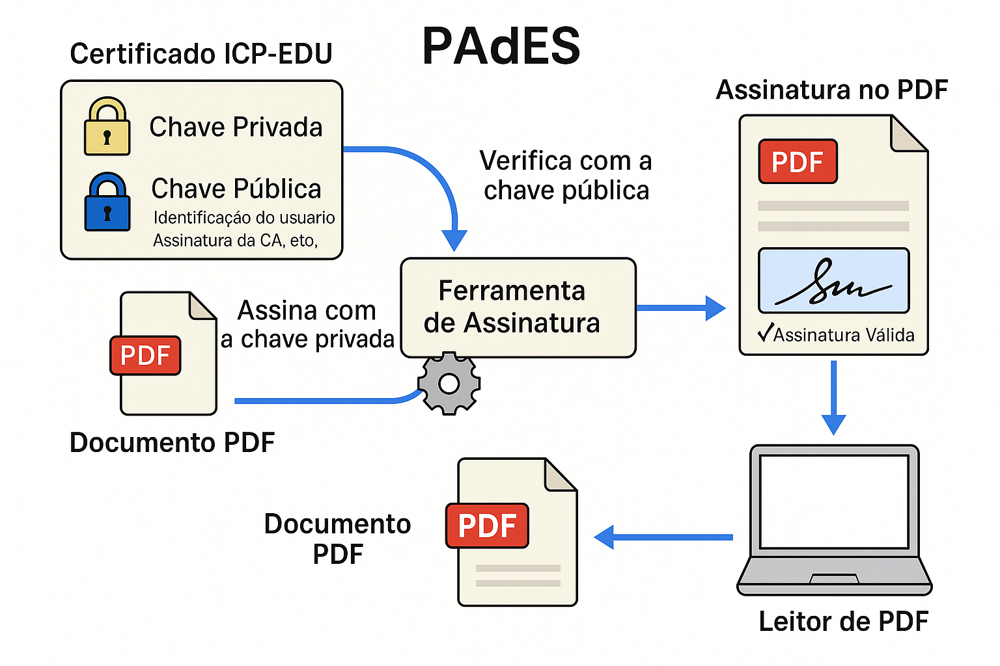

# 📄 Assinatura Digital de PDF (PAdES) usando ICP‑EDU

Esta pasta contém um conjunto completo de exemplos para **assinar e
verificar PDFs** utilizando certificados digitais emitidos pela
**ICP‑EDU/RNP**, no padrão **PAdES** --- o mesmo usado em documentos
assinados digitalmente em órgãos públicos e no SEI.

Os arquivos aqui permitem que o aluno:

✔ Assine um PDF com sua **chave privada** ICP‑EDU
✔ Gere um **PDF assinado internamente**, validável no Adobe Reader
✔ Verifique assinaturas via PyHanko
✔ Entenda como funciona **PAdES**, **PKI**, **ICP‑EDU** e assinaturas de
documentos

------------------------------------------------------------------------

# 🏛️ 1. Pré‑requisitos

### 🔐 Certificado ICP‑EDU (pessoal)

O aluno deve emitir seu certificado em: https://pessoal.icpedu.rnp.br/home

Ele será baixado no formato:

    meucertificado.p12

### 🗝️ Converter o arquivo .p12 para PEM

#### Extrair chave privada:

    openssl pkcs12 -in meucertificado.p12 -out chave_privada.pem -nocerts -nodes

#### Extrair certificado público:

    openssl pkcs12 -in meucertificado.p12 -out certificado_publico.pem -clcerts -nokeys

------------------------------------------------------------------------

# 📦 2. Arquivos desta pasta

    PDF/
    ├── assinar_pdf.py
    ├── verificar_pdf.py
    ├── config.yaml
    └── (seu documento.pdf)

### **assinar_pdf.py**

Script Python que assina um PDF usando PyHanko (PAdES invisível).

### **verificar_pdf.py**

Script que valida internamente as assinaturas do PDF.

### **config.yaml**

Arquivo de configuração para uso da CLI do PyHanko.

------------------------------------------------------------------------

# 🐍 3. Instalação do PyHanko

    pip install pyhanko

------------------------------------------------------------------------

# ✍️ 4. Assinando um PDF via Python

Coloque um arquivo chamado:

    documento.pdf

e execute:

    python assinar_pdf.py

Isso gera:

    documento_assinado.pdf

O arquivo já estará assinado no padrão **PAdES**, compatível com Adobe
Reader.

------------------------------------------------------------------------

# 🔍 5. Verificando a assinatura do PDF

    python verificar_pdf.py

O script exibirá:

-   lista de campos de assinatura
-   resultado (VÁLIDA / INVÁLIDA)
-   relatório resumido da validação

------------------------------------------------------------------------

# 🧠 6. O que é PAdES?

PAdES (PDF Advanced Electronic Signatures) é o padrão europeu para
assinatura digital de PDFs, baseado em:

-   PKI (infraestrutura de chaves públicas)
-   Certificados X.509
-   Assinaturas CMS/CAdES
-   Registro interno dentro do PDF

O Adobe Reader reconhecerá a assinatura como válida **desde que o
certificado esteja confiável**.

## Fluxo:

------------------------------------------------------------------------

# 📝 7. Exemplo de uso com PyHanko CLI

Assinatura:

    pyhanko sign addsig   --config config.yaml   -S meu_cert_icpedu   documento.pdf   documento_assinado.pdf

Validação:

    pyhanko sign validate --pretty documento_assinado.pdf

------------------------------------------------------------------------

# 🎓 8. Exercício sugerido

1.  Emitir seu certificado ICP‑EDU
2.  Converter para PEM
3.  Criar um PDF simples
4.  Assiná‑lo usando `assinar_pdf.py`
5.  Validar com `verificar_pdf.py` e com o Adobe Reader
6.  Subir o PDF assinado no repositório da disciplina

------------------------------------------------------------------------

# 🏁 9. Conclusão

Este módulo fornece uma experiência **real e profissional** com assinatura digital:

-   compatível com padrões ICP‑Brasil\
-   validável em ferramentas oficiais\
-   extremamente relevante para ensino de segurança e criptografia

Use à vontade no IFRN! 🔰
